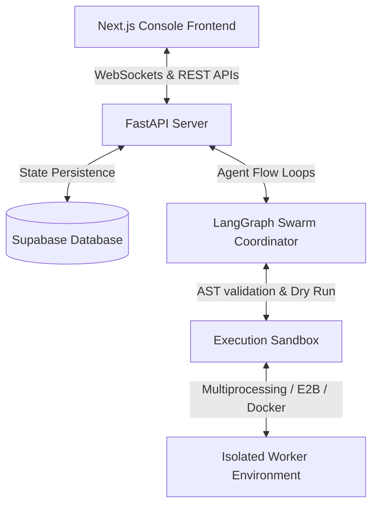

# 🌌 NULL_POINTER: Sentient Swarm Simulation & Security Console

`NULL_POINTER` is a real-time, interactive multi-agent sandbox and security playground where autonomous agent swarms evolve, self-modify, and execute code patches under strict governance constraints. Operators can observe the simulation stability, inspect agent cognitive traces, and red-team the sandbox environments.

---

## 🏗️ Core System Architecture

The platform is divided into a high-performance Python backend managing agent execution loops and a Next.js terminal console for real-time visualization and control.



### Component Breakdown
1. **Next.js Console Frontend**: Implements a dark cyberpunk terminal interface featuring Monaco-based code editors, live trace visualizers, simulation clock indicators, and operator presence tracking.
2. **FastAPI Backend Server**: Exposes REST interfaces and WebSocket channels for broadcasting live stability metrics, logs, events, and player inputs.
3. **LangGraph Swarm Coordinator**: Dictates the state graph flow (Supervisor ➔ Specialist ➔ Critic ➔ Communicate) that automates patch proposal cycles.
4. **Execution Sandbox**: Enforces code security using AST (Abstract Syntax Tree) visitors, capability dropping, and multiprocessing process isolation.

---

## 📂 Repository Layout

```ascii
NULL_POINTER/
├── backend/                       # Python Backend Services
│   ├── agents/                    # LangGraph Swarms & Ghost Engines
│   │   ├── archetypes.py          # Agent behavior profiles
│   │   └── hive_mind.py           # Swarm state transitions
│   ├── auth/                      # Authentication & SSO
│   │   └── oauth2.py              # Clerk/GitHub/Google OAuth2
│   ├── data/                      # Local JSON storage fallbacks
│   ├── models/                    # Pydantic & typed state structures
│   ├── services/                  # Core Business Logic
│   │   ├── agent_memory.py        # Embeddings & memory vector retrieval
│   │   ├── sandbox_executor.py    # AST safety filters & process runners
│   │   └── world_store.py         # DB snapshot sync & event dispatchers
│   ├── utils/                     # WebSockets & tracers
│   ├── main.py                    # FastAPI main app & routing endpoints
│   └── requirements.txt           # Backend package dependencies
│
└── frontend/                      # React / Next.js Console Frontend
    ├── src/
    │   ├── app/                   # Next.js routes & dashboard layouts
    │   ├── components/            # Monaco editors, terminal console, panel tabs
    │   ├── store/                 # Zustand global simulation state
    │   └── styles/                # CSS configurations & glassmorphism
    └── package.json               # Frontend dependencies & npm scripts
```

---

## 🔒 Security & Sandbox Isolation

To prevent dynamic agent-generated code from compromising system resources, the platform uses a layered security model:

### 1. Static AST Filtering
Before execution, every script is parsed into a Python AST. The `SecurityVisitor` scans the node tree and blocks:
* Introspection/dangerous builtins (`eval`, `exec`, `__import__`, `open`, `compile`, `getattr`, `setattr`).
* Network and OS packages (`os`, `sys`, `subprocess`, `socket`, `requests`, `urllib`).
* Double-underscore names and private attributes.

### 2. Process Isolation (Local Sandbox)
For local sandboxing, the execution is spawned in an isolated daemon process using `multiprocessing`. System capability attributes and builtins are overridden:
* Stdout/Stderr streams are redirected to in-memory buffers.
* Strict execution time limits are enforced via process timeouts to prevent infinite loops.

### 3. Container & Cloud Sandboxing (Docker & E2B)
In production settings, execution automatically shifts to Docker containers or E2B sandbox microVMs, dropping all linux capabilities (`CAP_DROP`), blocking network access, and clamping memory limits to 128MB.

---

## 🚀 Setup & Execution Guide

### Prerequisites
* **Python**: `3.10` or higher
* **Node.js**: `18.x` or higher

---

### Backend Setup

1. **Configure Environment Variables**:
   Create a `.env` file under the `/backend` directory:
   ```env
   OPENAI_API_KEY=your_openai_api_key
   SUPABASE_URL=your_supabase_url
   SUPABASE_KEY=your_supabase_service_role_key
   ```
   *Note: If Supabase credentials are left as placeholders, the system will fall back to local file-based storage (`backend/data/world_state.json`) automatically.*

2. **Install Dependencies**:
   ```bash
   cd backend
   pip install -r requirements.txt
   ```

3. **Start the FastAPI Server**:
   ```bash
   python -m uvicorn backend.main:app --host 0.0.0.0 --port 8000
   ```

---

### Frontend Setup

1. **Install Node Packages**:
   ```bash
   cd frontend
   npm install
   ```

2. **Start the Next.js Dev Server**:
   ```bash
   npm run dev
   ```

3. **Observe Console**:
   Open [http://localhost:3000](http://localhost:3000) to access the console terminal.